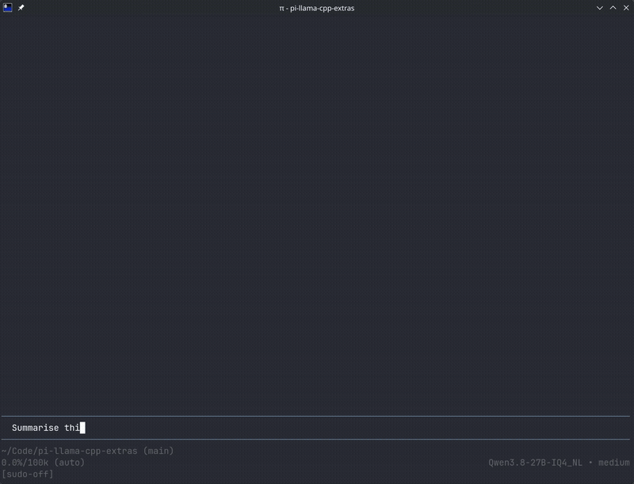

# pi-llama-cpp-extras

Extras for the [pi-llama-cpp](https://github.com/gsanhueza/pi-llama-cpp) Pi extension.

Requires `pi-llama-cpp >= 0.10.0` to be installed. This package installs alongside pi-llama-cpp and adds opt-in extras without forking it.

## Demo



## Live progress display

Shows live progress on pi's working message line (`⏼ Working…`) while a llama.cpp request is running.

- **Prefill.** Progress bar driven by llama.cpp's `prompt_progress` SSE field:
  `Prefilling… ▓▓▓░░░ 40% · 3.2s · 1012.7 tok/s`
- **Thinking.** Token counter while the model reasons:
  `Working… ~1.2k tok · 8s`

No configuration needed. The display appears automatically on any request sent to a llama.cpp server managed by pi-llama-cpp and clears itself when the request finishes. With multiple servers configured, the line reflects whichever request is active.

## Installation

```bash
pi install npm:pi-llama-cpp-extras
```

No settings of its own. It reads the same server configuration pi-llama-cpp uses (`llamaSettings.servers` or the legacy `llamaServerUrl`).

## Requirements

- pi `>= 0.84.0`
- pi-llama-cpp `>= 0.10.0`

## How it works

pi-llama-cpp registers one provider per llama.cpp server without a `streamSimple`. This package reconstructs the same server list from the same settings and registers a teed `streamSimple` on the same provider IDs. Pi's provider merge composes the two, so requests stream through this package's wrapper which parses progress out of the SSE and passes the rest through.

## Development

```bash
npm test
npm run typecheck
```

Tested on pi `0.84.x` and pi-llama-cpp `0.10.x`.

## License

MIT
